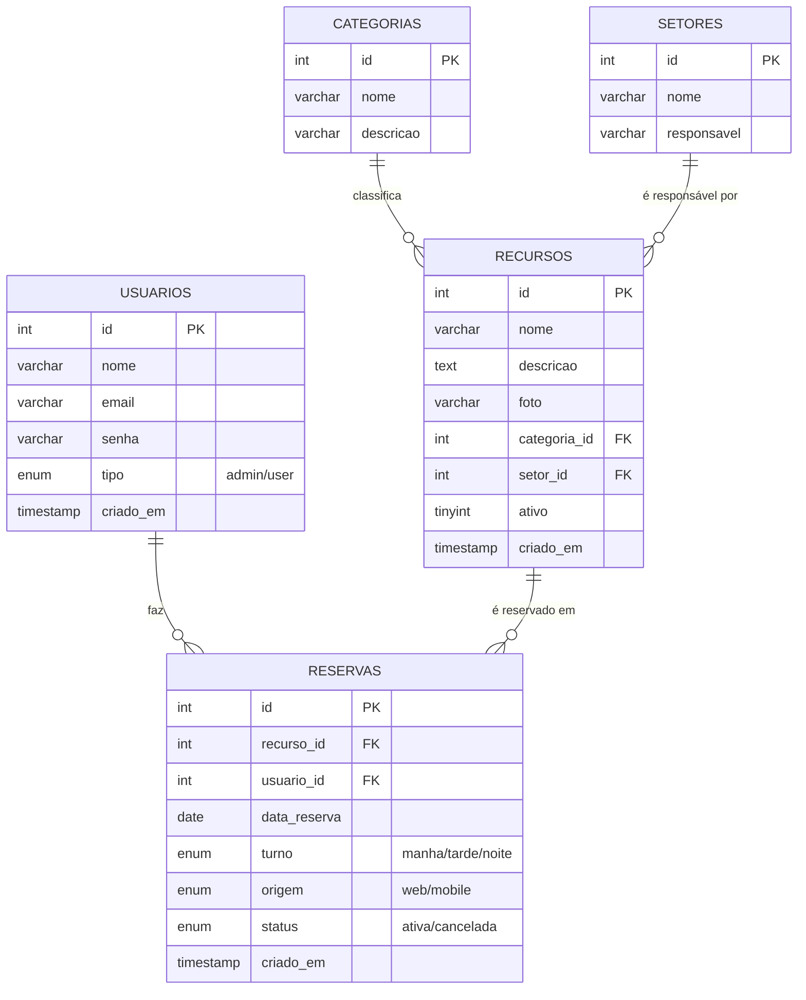

# 🗄️ DER — Diagrama Entidade-Relacionamento

Modelo do banco de dados `reservas_db`. (Renderiza no GitHub / VS Code com extensão Mermaid.)

## Relacionamentos
- Um **usuário** faz muitas **reservas** (1:N).
- Um **recurso** pode ter muitas **reservas** (1:N).
- Uma **categoria** classifica muitos **recursos** (1:N).
- Um **setor** é responsável por muitos **recursos** (1:N).

## Regras importantes
- `reservas` tem **UNIQUE (recurso_id, data_reserva, turno)** → evita reservar o mesmo recurso no
  mesmo dia e turno duas vezes.
- `origem` registra se a reserva veio do **web** ou do **mobile**.
