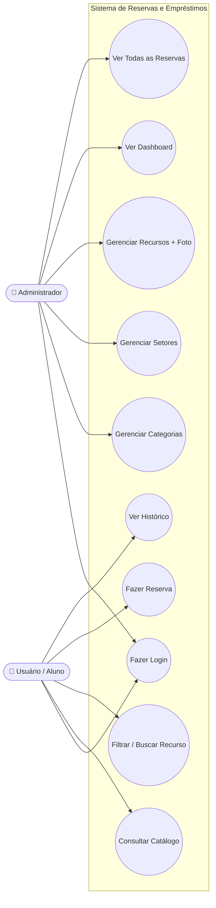

# 🎭 Diagrama de Casos de Uso

Atores: **Administrador** e **Usuário (Aluno)**. (Mermaid)

## Descrição dos Casos de Uso

| Caso de Uso | Ator | Descrição |
|---|---|---|
| Fazer Login | Ambos | Autentica no sistema (web e mobile). |
| Gerenciar Categorias | Admin | Criar, editar e excluir categorias. |
| Gerenciar Setores | Admin | Criar, editar e excluir setores. |
| Gerenciar Recursos | Admin | Cadastrar recursos com foto, categoria e setor. |
| Ver Dashboard | Admin | Visualizar contadores e últimas reservas. |
| Ver Todas as Reservas | Admin | Listar reservas de todos os usuários (web e mobile). |
| Consultar Catálogo | Usuário | Ver a lista de recursos disponíveis. |
| Filtrar / Buscar | Usuário | Filtrar por categoria ou buscar por nome. |
| Fazer Reserva | Usuário | Reservar um recurso por data e turno (sem aprovação). |
| Ver Histórico | Usuário | Consultar as próprias reservas. |
