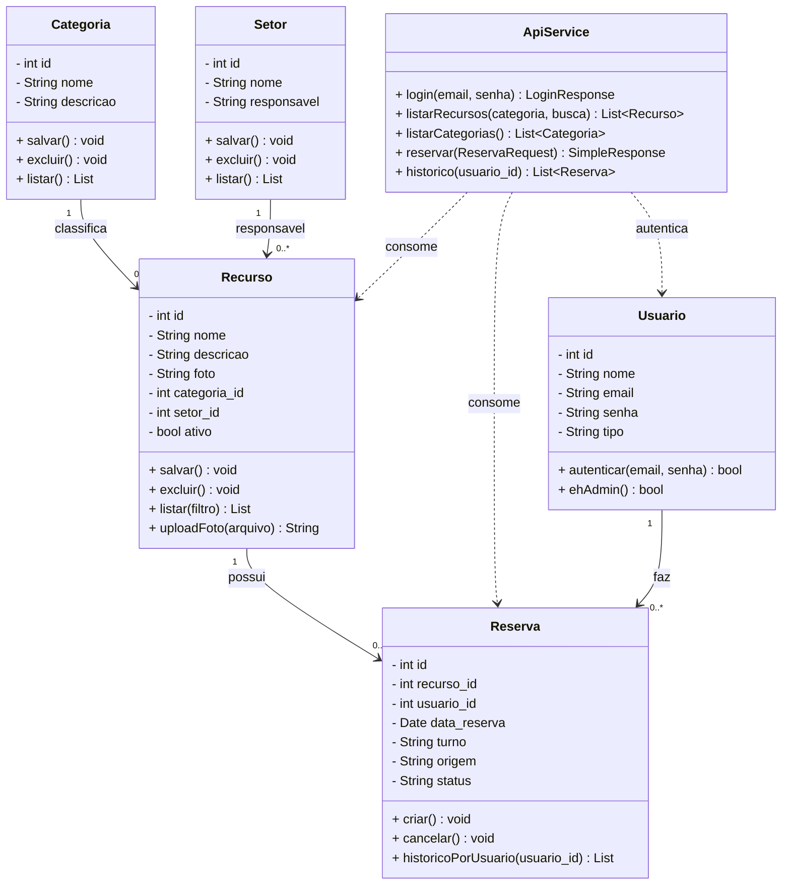

# 🧩 Diagrama de Classes

Classes do sistema com **atributos** e **métodos**. (Mermaid)

## Observações
- As classes **Usuario, Categoria, Setor, Recurso e Reserva** representam as entidades do banco
  (mapeadas no Web em PHP e no Mobile como POJOs Java).
- **ApiService** é a interface Retrofit no app Android que consome os endpoints JSON do servidor.
